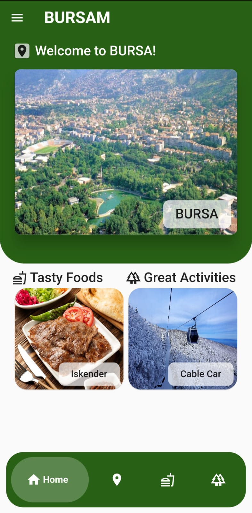
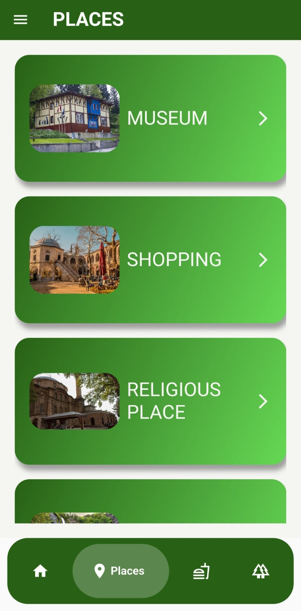
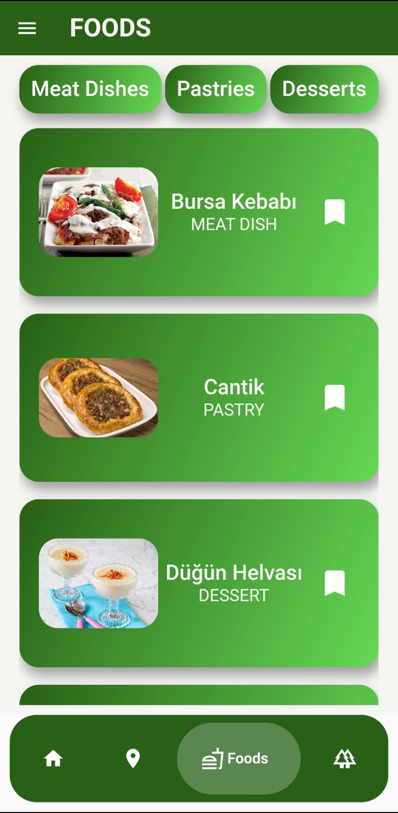
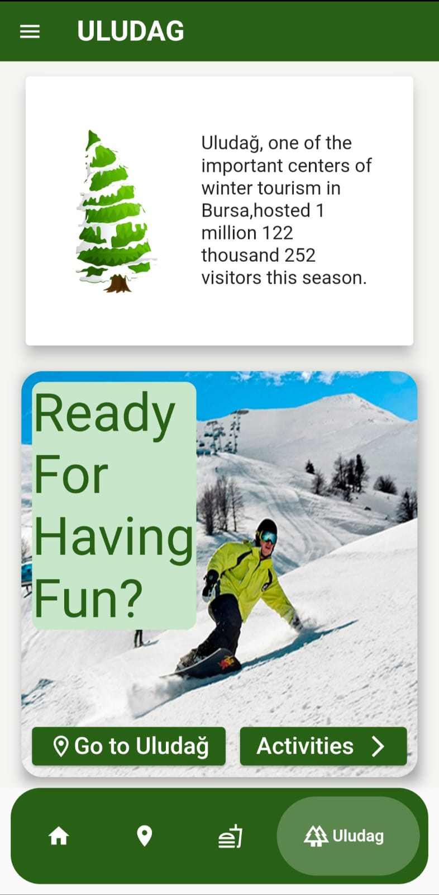

# Bursam-App
<b>Bursam App</b> 
-I made an app for visitors when they are coming to visit Bursa. 
-I used sqflite for datas. 
-You can run the code for more explore. 
-These are some of the screenshots of my project. 

